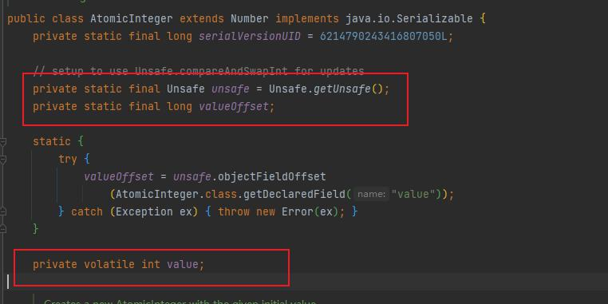

# CAS

compare and swap 的缩写,中文意思为比较并替换.  
他有三个操作数:  
1. 内存位置: 该值在内存上的位置
2. 预期原值: 从内存中拿到的值,例如,线程从主内存中拿到的值,在工作内存中的表现
3. 更新值: 要更新的值

cas操作:
将内存位置的值与预期值相比较,如果相同,则更新,不同则不更新.
多个线程同时操作CAS只有一个会成功


---

原子类的compareAndSet方法底层就是用的native的cas方法实现的


变量valueOffset，表示该变量值在内存中的偏移地址，因为Unsafe就是根据内存偏移地址获取数据的。



变量value用volatile修饰，保证了多线程之间的内存可见性。
```java
    public final native boolean compareAndSwapObject(Object var1, long var2, Object var4, Object var5);

    public final native boolean compareAndSwapInt(Object var1, long var2, int var4, int var5);

    public final native boolean compareAndSwapLong(Object var1, long var2, long var4, long var6);
```


# Unsafe类
是CAS的核心类，由于Java方法无法直接访问底层系统，需要通过本地（native）方法来访问，Unsafe相当于一个后门，基于该类可以直接操作特定内存的数据。Unsafe类存在于sun.misc包中，其内部方法操作可以像C的指针一样直接操作内存，因为Java中CAS操作的执行依赖于Unsafe类的方法。
注意Unsafe类中的所有方法都是native修饰的，也就是说Unsafe类中的方法都直接调用操作系统底层资源执行相应任务 


--------
总结:

CAS是靠硬件实现的从而在硬件层面提升效率，最底层还是交给硬件来保证原子性和可见性
实现方式是基于硬件平台的汇编指令，在intel的CPU中(X86机器上)，使用的是汇编指令cmpxchg指令。 

核心思想就是：比较要更新变量的值V和预期值E（compare），相等才会将V的值设为新值N（swap）如果不相等自旋再来。


# 利用CAS思想实现的自旋锁
```java
private static void spinLock(){
        // 自旋锁,借鉴CAS思想 使用该方式必须每个线程都要判断变量,否则感觉没什么用了就
        new Thread(()->{

            try {
                sleep(500);
            } catch (InterruptedException e) {
                e.printStackTrace();
            }
            // 获得锁
            mySpinLock();
            System.out.println(Thread.currentThread().getName()+"正在使用中...");
            try {
                sleep(5000);
            } catch (InterruptedException e) {
                e.printStackTrace();
            }
            System.out.println(Thread.currentThread().getName()+"使用完毕...");
            mySpinUnLock();
        },"task-a").start();


        new Thread(()->{
            mySpinLock();
            System.out.println(Thread.currentThread().getName()+"正在使用中...");
            try {
                sleep(3000);
            } catch (InterruptedException e) {
                e.printStackTrace();
            }
            System.out.println(Thread.currentThread().getName()+"使用完毕...");
            mySpinUnLock();
        },"task-b").start();


    }

    private static void mySpinLock() {
        System.out.println(Thread.currentThread().getName() + "线程准备获得锁");
        // 代替原来的加锁,但是cpu会有所消耗
        while (!reference.compareAndSet(null, Thread.currentThread())) {
        }
    }

    private static void mySpinUnLock() {
        reference.compareAndSet(Thread.currentThread(), null);
        System.out.println(Thread.currentThread().getName() + "已经释放锁");
    }

```


实现自旋锁的一个好处就是不用加synchronized这种重量级的锁,相对乐观,但是如果数据频繁会修改的话,那么还是synchronized比较合适一点,线程的唤醒虽然没有循环快,但是一直循环得不到也会加重cpu负担


# CAS会造成的一个问题ABA
这个问题其实很简单  
ex:  
初始变量为1
线程a 读取并替换为2
线程b 读取2又替换为1
线程c 如果同时读到的是第一个版本的1,也会进行更新

程序实际运行不正确,但是大概率不会影响结果,不过最好还是解决了aba问题


利用版本号解决ABA问题


如使用原子类中带邮戳stamp的原子类,每次更新都连带更新一次版本号即可避免ABA问题的出现

```java
    private static void solvingABAProblems() throws InterruptedException {
        new Thread(() ->{
            int stamp = sharedVariable.getStamp();
            System.out.println(sharedVariable.compareAndSet(1, 2, stamp, stamp + 1));
            System.out.println(sharedVariable.compareAndSet(2, 3, 2, 3));
        }).start();
        Thread.sleep(500);
        new Thread(()->{
            int stamp = sharedVariable.getStamp();
            int expectedint= sharedVariable.getReference();
            System.out.println(sharedVariable.compareAndSet(expectedint, expectedint + 1, stamp, stamp + 1));
        }).start();
    }
```

# CAS的缺点
CAS的缺点主要有三点:

1. ABA问题,以上已有解决方法
2. 循环时间长,开销大,自旋CAS的方式如果长时间不成功,会给CPU带来很大开销
3. 只能保证一个共享变量的原子操作,多个也可以利用CAS和AtomicReference等操作,这个缺点并不算啥吧....
