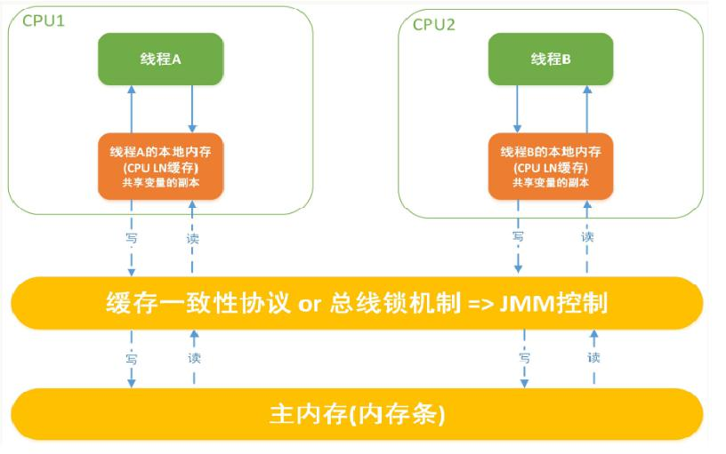

# JMM的一些规范

JMM就是java内存模型
JMM的关键技术点都是围绕多线程的原子性,可见性和有序性展开的

JMM规定了变量都保存在主内存中
1. 原子性
一个操作不可中断,多线程环境下,操作不能被其他线程干扰
2. 可见性
一个线程改变了一个变量,那么其他线程可以立马知道.(因为所有线程都是读的主内存中的变量)
3. 有序性
一个线程执行代码,肉眼看到像是从上往下运行,但是为了提供性能,编译器和处理器会对指令序列进行重新排序
指令重排可以保证串行代码语义一直,但是不能保证多线程间也语义一致,可能产生线程的脏读

单线程环境里面确保程序最终执行结果和代码顺序执行的结果一致。
处理器在进行重排序时必须要考虑指令之间的数据依赖性
多线程环境中线程交替执行,由于编译器优化重排的存在，两个线程中使用的变量能否保证一致性是无法确定的,结果无法预测

---
**JMM规定的多线程下对变量的读取过程**  
读取过程：
由于JVM运行程序的实体是线程，而每个线程创建时JVM都会为其创建一个工作内存(有些地方称为栈空间)，工作内存是每个线程的私有数据区域，而Java内存模型中规定所有变量都存储在主内存，主内存是共享内存区域，所有线程都可以访问，但线程对变量的操作(读取赋值等)必须在工作内存中进行，首先要将变量从主内存拷贝到的线程自己的工作内存空间，然后对变量进行操作，操作完成后再将变量写回主内存，不能直接操作主内存中的变量，各个线程中的工作内存中存储着主内存中的变量副本拷贝，因此不同的线程间无法访问对方的工作内存，线程间的通信(传值)必须通过主内存来完成，其简要访问过程如下图:

---
**JMM定义了线程和主内存之间的抽象关系**  
1. 线程之间的共享变量存储在主内存中(从硬件角度来说就是内存条)
2. 每个线程都有一个私有的本地工作内存，本地工作内存中存储了该线程用来读/写共享变量的副本(从硬件角度来说就是CPU的缓存，比如寄存器、L1、L2、L3缓存等)

***总结***  
* 我们定义的所有共享变量都储存在物理主内存中
* 每个线程都有自己独立的工作内存，里面保存该线程使用到的变量的副本(主内存中该变量的一份拷贝)
* 线程对共享变量所有的操作都必须先在线程自己的工作内存中进行后写回主内存，不能直接从主内存中读写(不能越级)
* 不同线程之间也无法直接访问其他线程的工作内存中的变量，线程间变量值的传递需要通过主内存来进行(同级不能相互访问)

# happens-before
JMM中有一个原则  “先行发生”(Happens-Before)的原则限制和规矩  
它是判断数据是否存在竞争，线程是否安全的非常有用的手段。依赖这个原则，我们可以通过几条简单规则一揽子解决并发环境下两个操
作之间是否可能存在冲突的所有问题，而不需要陷入Java内存模型苦涩难懂的底层编译原理之中。  
---
最基本的就两句话

1. 如果一个操作happens-before另一个操作，那么第一个操作的执行结果将对第二个操作可见，而且第一个操作的执行顺序排在第二个操作之前。
2. 两个操作之间存在happens-before关系，并不意味着一定要按照happens-before原则制定的顺序来执行。如果重排序之后的执行结果与按照happens-before关系来执行的结果一致，那么这种重排序并不非法。

---
如果要是细分的话,有八条原则

1.  次序规则：
2.  锁定规则：
3.  volatile变量规则：
4.  传递规则：
5.  线程启动规则(Thread Start Rule)：
6.  线程中断规则(Thread Interruption Rule)：
7.  线程终止规则(Thread Termination Rule)：
8.  对象终结规则(Finalizer Rule)：