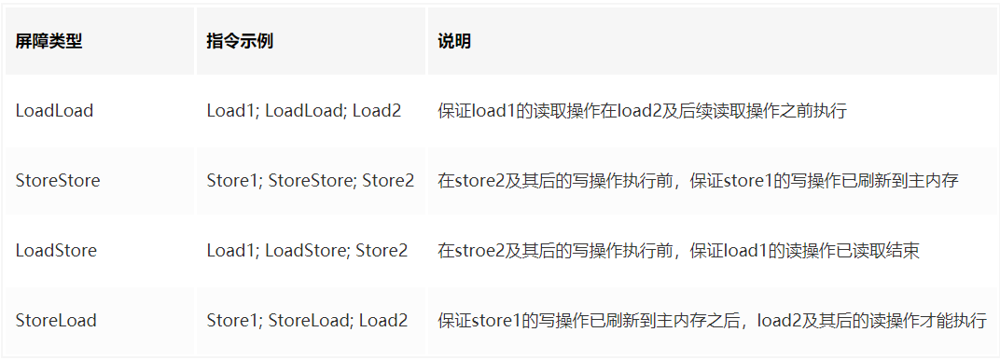
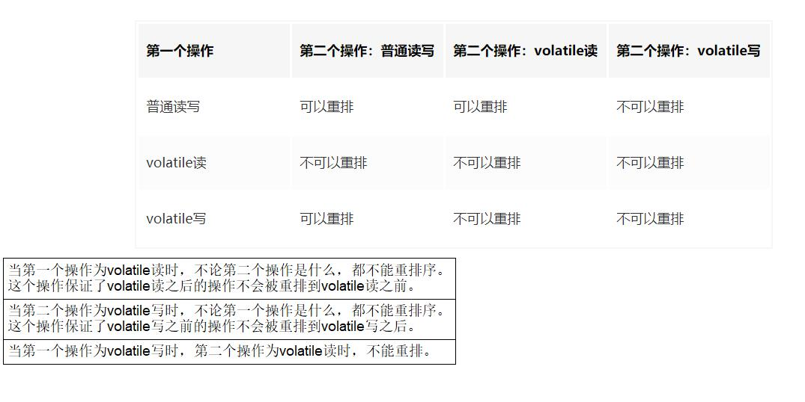

volatile是java虚拟机提供的一种轻量级同步机制  
特点是: 保证可见性,不保证原子性,禁止指令重排

相对于synchronized更加轻量

---
被volatile修饰的变量有两大特点:  1. 可见性 2. 有序性  但是不保证原子性  

volatile的内存语义:  
1. 当写一个volatile变量时,JMM会把当前线程对应的本地变量中的共享变量值立即刷会主内存中
2. 当读一个volatile变量时,JMM会把当前线程对应的本地变量中的共享变量值置为失效,直接从主内存中读取共享变量
3. 得到结论,volatile的读是直接从主内存读取,写是直接刷新到主内存中

---
一些理论说明:  
 内存屏障（也称内存栅栏，内存栅障，屏障指令等，是一类同步屏障指令，是CPU或编译器在对内存随机访问的操作中的一个同步点，使得此点之前的所有读写操作都执行后才可以开始执行此点之后的操作），避免代码重排序。内存屏障其实就是一种JVM指令，Java内存模型的重排规则会要求Java编译器在生成JVM指令时插入特定的内存屏障指令，通过这些内存屏障指令，volatile实现了Java内存模型中的可见性和有序性，但volatile无法保证原子性。

内存屏障之前的所有写操作都要回写到主内存，
内存屏障之后的所有读操作都能获得内存屏障之前的所有写操作的最新结果(实现了可见性)。

因此重排序时，不允许把内存屏障之后的指令重排序到内存屏障之前。
一句话：对一个 volatile 域的写, happens-before 于任意后续对这个 volatile 域的读，也叫写后读。

通过源码可以找到四个直接操作内存的指令  

|loadload|acquire|
|storestore|release|
|loadstore|acquire|
|storeload|fence|





---
# 四种内存屏障策略
volatile写(2个屏障):

在每个volatile写前加一个storestore屏障,在其之后加一个storeload屏障

volatile读(2个屏障):

在每个volatile读后加一个loadload屏障,紧接着之后再加一个loadstore屏障

总结: 




# 几种应用场景
 
***需要保证原子性的操作不要使用volatile,如对变量的写操作不依赖当前值等***

1. 作为一个状态标志,比如判断业务是否该结束
```java
    private static volatile boolean flag = false;
    private static void checkFlag() throws InterruptedException {

        new Thread(() ->{
            while(true){
                System.out.println("程序执行中...");
                if (flag){
                    System.out.println("程序退出...");
                    break;
                }
            }
        }).start();

        Thread.sleep(5000);

        new Thread(()->{
            flag=true;
        }).start();
    }
```
2. 当读远多于写,结合使用内部锁和volatile变量减少同步开销
```java
    private class readMoreAndWriteLess {
		// 保证读取操作可见性
        private volatile int a = 0;
        
        public int read(){
            return a;
        }
        // 复合操作用synchronized保证原子性
        public synchronized int add(){
            return a++;
        }
    }
```
3. 单例模式,双端检测使用

```java
public class SafeDoubleCheckSingleton
{
    //通过volatile声明，实现线程安全的延迟初始化。
    private volatile static SafeDoubleCheckSingleton singleton;
    //私有化构造方法
    private SafeDoubleCheckSingleton(){
    }
    //双重锁设计
    public static SafeDoubleCheckSingleton getInstance(){
        if (singleton == null){
            //1.多线程并发创建对象时，会通过加锁保证只有一个线程能创建对象
            synchronized (SafeDoubleCheckSingleton.class){
                if (singleton == null){
                    //隐患：多线程环境下，由于重排序，该对象可能还未完成初始化就被其他线程读取
                                      //原理:利用volatile，禁止 "初始化对象"(2) 和 "设置singleton指向内存空间"(3) 的重排序
                    singleton = new SafeDoubleCheckSingleton();
                }
            }
        }
        //2.对象创建完毕，执行getInstance()将不需要获取锁，直接返回创建对象
        return singleton;
    }
}


```
另,还有一种静态内部类实现的单例
```java
public class SingletonDemo
{
    private SingletonDemo() { }

    private static class SingletonDemoHandler
    {
        private static SingletonDemo instance = new SingletonDemo();
    }

    public static SingletonDemo getInstance()
    {
        return SingletonDemoHandler.instance;
    }
}
```

---
对于双端检测配合volatile的一些疑惑点

以下是当天自己理解的,再做整理吧

问题:

为什么多线程会影响单例模式

单线程却不会


理解了

是在new对象的时候有问题出现了;;new对象实际上有三步在走,   申请内存空间, 在此内存空间初始化对象, 将引用指向该内存空间


出现问题的是


如果没有禁止指令重排的话

可能会出现 申请内存空间,然后就将此引用指向了该内存空间的地址(此时为空) , 之后再在该内存空间初始化了对象
这样对单线程而言,最后还是初始化出来了,无所谓
但是对多线程就不一样了,如果此时该引用已经指向了新的内存空间(这里并没有初始化的内容),这时另一个线程进来了,它会获取到该引用已经有内存空间了,这时就会返回一个空的内存空间,与加锁的那块无关,只是引用在那块已经有内容,然后直接返回该引用了

但是如果分配了内存地址后该引用是null那我上面说的就不攻自破了(查了网上的内容,应该是周阳讲的有歧义了,他说的null应该是内存中什么也没有,但是是有内存地址就不会是null的)

---