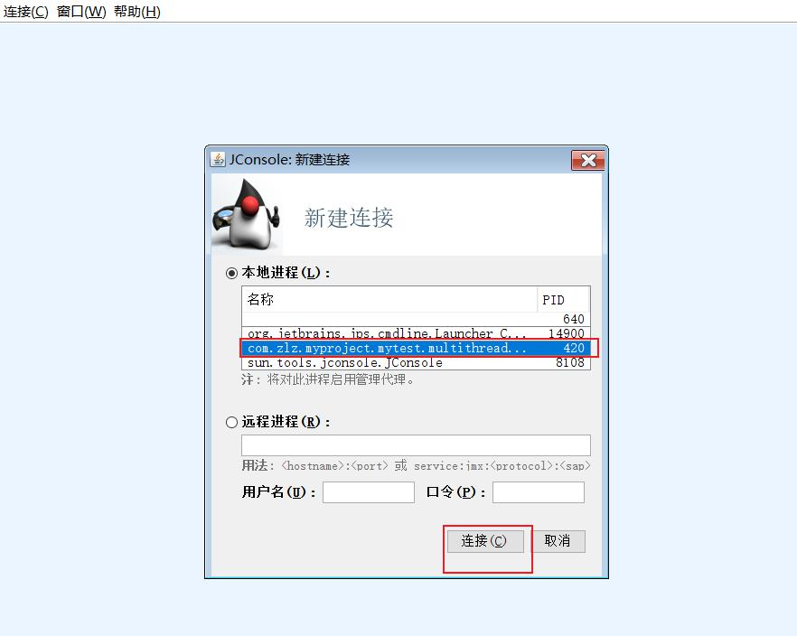
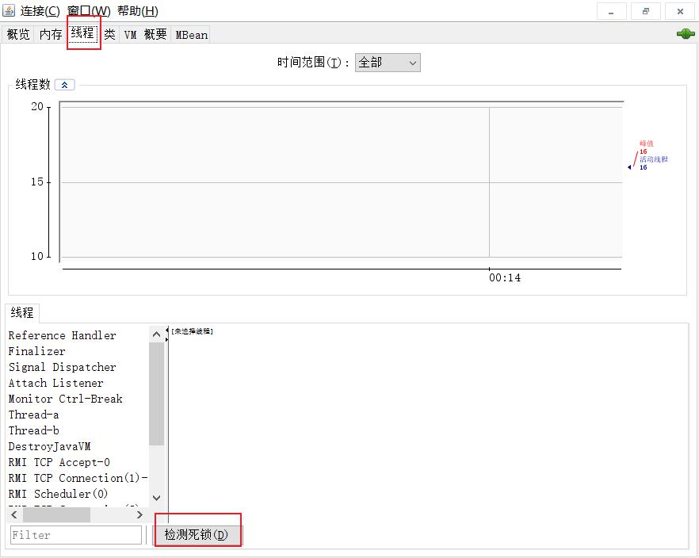
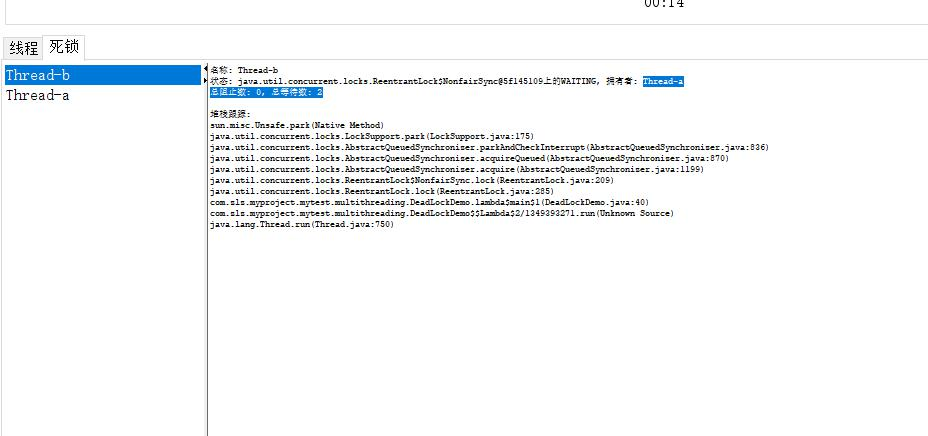
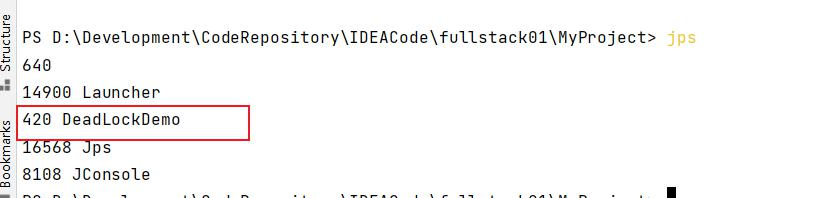
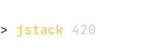
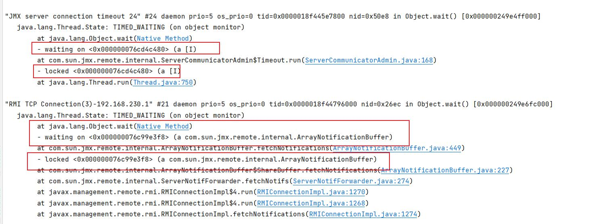
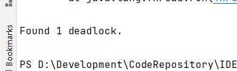

# 公平锁
加锁时考虑排队等待问题，按照申请锁的顺序，按照FIFO规则，先申请的线程先取得锁，其他线程进入队列等待锁的释放，当锁释放后，在队头的线程被唤醒。
# 非公平锁
加锁时不考虑排队等待问题，直接尝试获取锁。如果此时恰好锁处于unlock，则不管有没有其他线程在等待，直接拿到锁；否则就转化成公平锁的模式，进入队列等待。

> 非公平锁性能比公平锁高5~10倍，因为公平锁需要频繁唤醒队列中的线程，比较消耗资源.公平锁保证了线程按照先后顺序执行，但效率较低。非公平锁效率比较高，但是非公平锁让获取锁的时间变得更加不确定，可能会导致在阻塞队列中的线程长期处于饥饿状态

synchronized 属于非公平锁
ReentrantLock 可以定义公平和非公平,默认非公平

# 可重入锁
synchronized 和 ReentrantLock 属于可重入锁
即 一个线程如果获得了该对象锁之后,可以再次获得此锁而不需要之前的锁释放

# 死锁

demo1 使用了不同的锁方式,所以互不影响
```java
    public static void main(String[] args) {
        ReentrantLock locka = new ReentrantLock();
        ReentrantLock lockb = new ReentrantLock();
        // a 线程获得 a锁,准备获得b锁
        new Thread(() -> {
            synchronized (locka){
                System.out.println("a 线程已经获得 locka ,下一步试图获得 lockb");
                try {
                    Thread.sleep(2000);
                } catch (InterruptedException e) {
                    e.printStackTrace();
                }
                synchronized (lockb){
                    System.out.println("a 线程已经获得 lockb ");
                }
            }
        },"Thread-a").start();

        // b 线程获得 b锁,准备获得a锁
        new Thread(() ->{
            lockb.lock();
            System.out.println("b 线程已经获得 lockb ,下一步试图获得 locka");
            try {
                Thread.sleep(1000);
            } catch (InterruptedException e) {
                e.printStackTrace();
            }
            locka.lock();
            System.out.println("b 线程已经获得 locka ");
            locka.unlock();
            lockb.unlock();

        },"Thread-b").start();

    }
```

demo2 使用同一种锁方式,会导致死锁
```java
    public static void main(String[] args) {
        ReentrantLock locka = new ReentrantLock();
        ReentrantLock lockb = new ReentrantLock();
        // a 线程获得 a锁,准备获得b锁
        new Thread(() -> {
            locka.lock();
            System.out.println("a 线程已经获得 locka ,下一步试图获得 lockb");
            try {
                Thread.sleep(2000);
            } catch (InterruptedException e) {
                e.printStackTrace();
            }
            lockb.lock();
            System.out.println("a 线程已经获得 lockb ");
            lockb.unlock();
            locka.unlock();
            
        }, "Thread-a").start();

        // b 线程获得 b锁,准备获得a锁
        new Thread(() -> {
            lockb.lock();
            System.out.println("b 线程已经获得 lockb ,下一步试图获得 locka");
            try {
                Thread.sleep(1000);
            } catch (InterruptedException e) {
                e.printStackTrace();
            }
            locka.lock();
            System.out.println("b 线程已经获得 locka ");
            locka.unlock();
            lockb.unlock();

        }, "Thread-b").start();

    }
```


如何证明死锁
两种方式
1. 使用jconsole工具






2. 使用jps找到运行程序,使用jstack查看

jps相当于 java ps  找到PID jstack PID 







