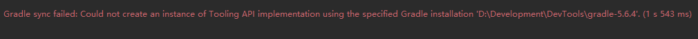
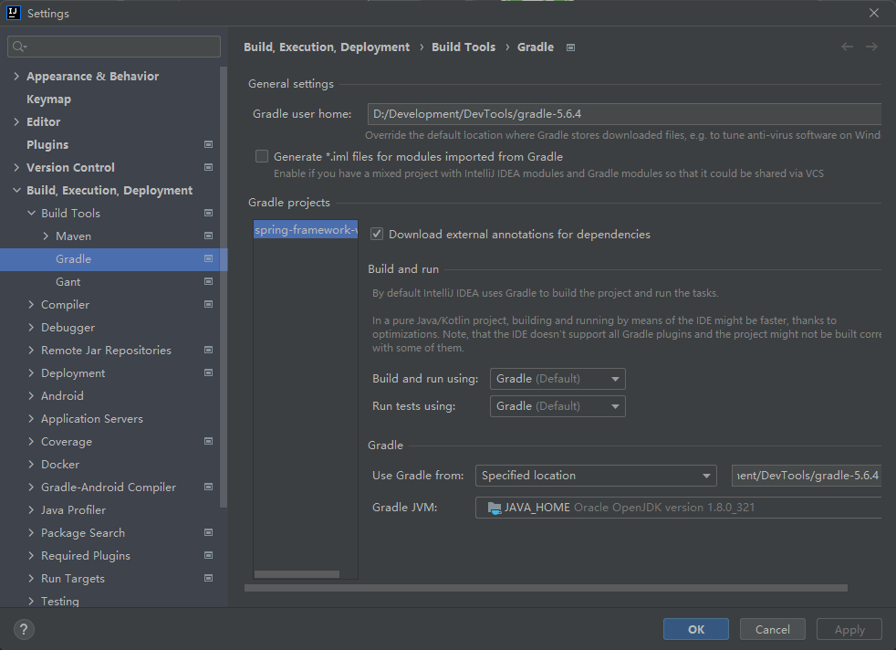
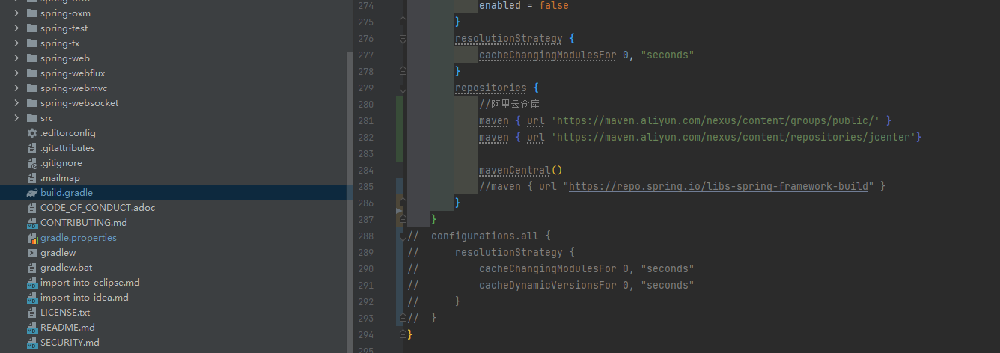
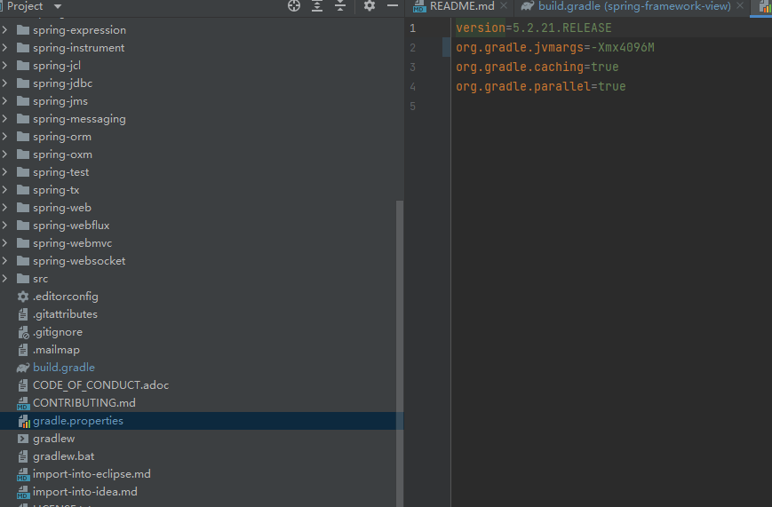
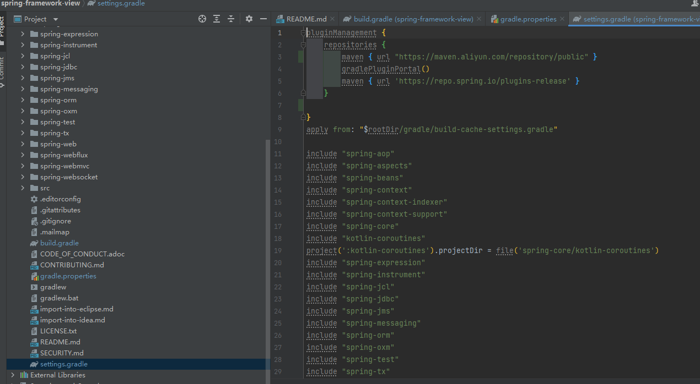
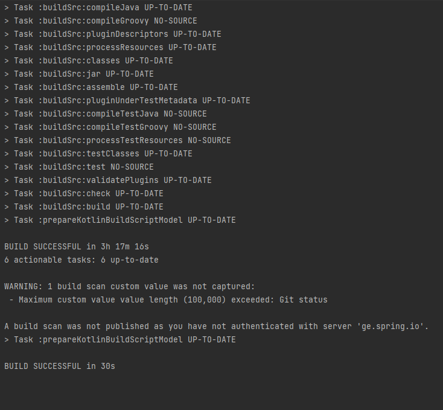
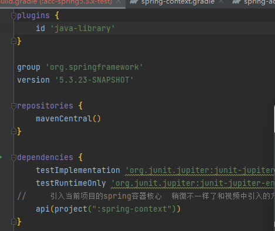
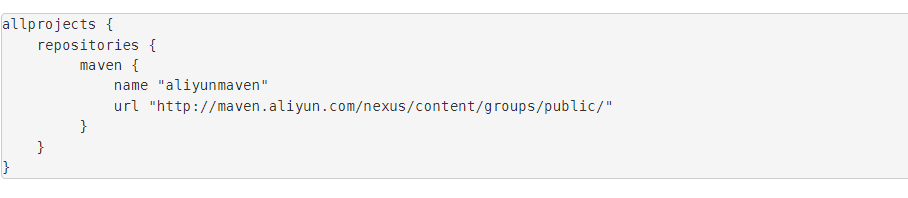
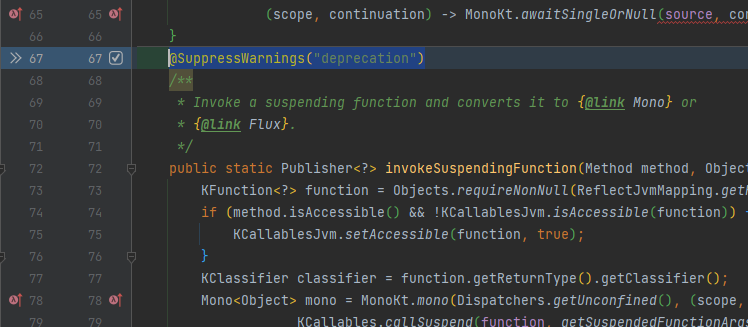

太难了,怎么弄都没有构建成功,我tm,跟着视频不行,跟着博客不行,这么麻烦吗,gradle,唯一的不同就是我用的jdk17,视频和博客用的jdk15

大坑,之后最好还是使用正版软件最好,用了社区版的idea立马可以构建成功了,不知道是哪里设置不对,但是以后还是用正版吧,少浪费一些时间在没用的事情上,即使你找到原因又能如何,没什么用

三个多小时,估计就是没有镜像加速的原因,但是网上的镜像加速放到init.d目录或者build.gradle中直接报错,估计都是旧版本吗,新版的还没找到,反正成功了,之后再找吧

---

依赖那里有些小坑,自建模块引入工程中其他模块的时候,gradle之前是使用compile的后面看到都是使用了api,但是直接使用api还是不行,需要在自建模块的build.gradle中指定id为java-library(原来是java)

还有一个,报错信息很明显,很多网上的帖子发的镜像加速都是类似这种样子的

这种的不是https的,gradle默认不能使用这种形式的,所以改一下http为https

---

目前使用的jdk1.8,spring5.3.x启动项目没任何问题

有一些报错需要抑制一下,比如CoroutinesUtils,需要抑制`@SuppressWarnings("deprecation")`

