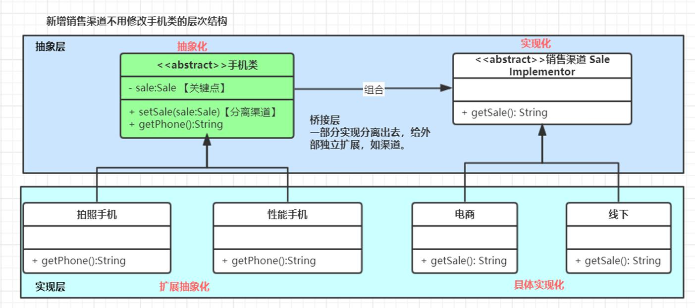

桥接模式将继承转为关联,降低代码耦合度,减少代码量
这个是需要系统设计期间就要准备好的,适配器是为了解决已经设计好的系统需要关联两个接口


其实很简单,看了图之后会更加明白   原理就是想要将一个类的一个属性抽象出来,然后在使用这个扩展抽象化角色的时候通过传入一个实现化角色来补充扩展抽象化角色的属性,使用的时候根据场景在扩展抽象化角色中组合实现化角色的业务实现两个类的桥接

桥接模式角色:

1. 抽象化角色: 定义一个抽象类,并包含一个对实现化对象的引用

```java
public abstract class AbstractPhone {
    // 将渠道分离出去
    AbstractSale abstractSale;

    // 使用的时候设置渠道,这样就可以供子类去调用渠道信息
    void setSale(AbstractSale abstractSale){
        this.abstractSale = abstractSale;
    }

    abstract String getPhoneInfo();
}
```

2. 扩展抽象化角色: 是抽象化对象的子类,实现父类的业务方法,并通过组合关系调用实现化角色中的业务方法.

可以有多个

```java
/**
 * @Description: 扩展抽象化角色,这里就可以直接调用 父类中的set方法从而使用sale信息
 * @Author: zhang
 * @Date: 2022/8/8
 * @Version: v1.0
 */
public class Iphone extends AbstractPhone{
    @Override
    String getPhoneInfo() {
        String info = "一部iPhone";
        // 这里简单演示,就直接使用父类的sale信息了
        return info+" : "+abstractSale.getSale();
    }
}
```


3. 实现化角色: 定义实现化角色的接口,供扩展抽象化角色调用.


```java
/**
 * @Description: 作为手机的一部分属性 销售渠道
 * @Author: zhang
 * @Date: 2022/8/8
 * @Version: v1.0
 */
public abstract class AbstractSale {
    abstract String getSale();
}

```

4. 实现化角色的具体实现

```java

/**
 * @Description: 一个销售渠道的具体子类
 * @Author: zhang
 * @Date: 2022/8/8
 * @Version: v1.0
 */
public class ECommerceChannel extends AbstractSale{
    @Override
    String getSale() {
        return "电商渠道";
    }
}

```

5. 使用

```java

public class MainDemo {
    public static void main(String[] args) {
        Iphone iphone = new Iphone();
        // 设置销售渠道信息 电商渠道
        ECommerceChannel eCommerceChannel = new ECommerceChannel();
        iphone.setSale(eCommerceChannel);
        // 获得这个手机的所有信息
        System.out.println("iphone.getPhoneInfo() = " + iphone.getPhoneInfo());
    }
}

```