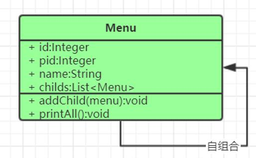

组合模式是把一组相似的对象当作一个单一的对象,如树形菜单之类的
类图


还有设计模式主要是学习其思想,别太那么死板,比如组合了其他对象还算组合模式吗之类的...
只能说最经典的就是树形菜单,自组合


```java
public class Menu {
    private String name;
    private String id;
    List<Menu> submenu = new ArrayList<>();
    public void addSubMenu(Menu menu) {
        submenu.add(menu);
    }
    public Menu(String name) {
        this.name = name;
    }
    // 打印子菜单方法
    public void printTree() {
        System.out.println("name = " + name);
        for (int i = 0; i < submenu.size(); i++) {
            submenu.get(i).printTree();
        }
    }
}
```


一个问题,如何打印出来每个级别的菜单有缩进