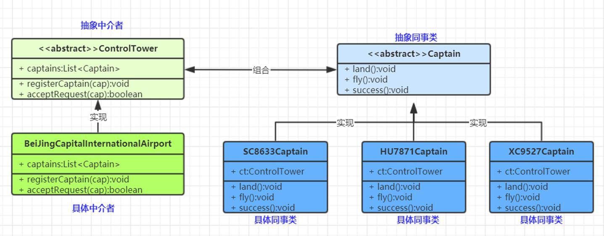

中介者模式(Mediator Pattern)：用一个中介对象来封装一系列的对象交互，中介者使各对象不需要显式地相互引用，减少对象间混乱的依赖关系，从而使其耦合松散，而且可以独立地改变它们之间的交互。对象行为型模式




---
为了方便就先简化代码了.

1. 中介者

```java

/**
 * @Description: 这就是那个中介,使不同User对象互相通信,而不是直接user与user之间通信
 * @Author: zhang
 * @Date: 2022/8/11
 * @Version: v1.0
 */
public class ChatroomMediator {
    static void showMsg(User user,String msg){
        System.out.println(user.getName() + ": 消息内容 :" + msg);
    }
}

```

2. 同事类

```java
@Data
public class User {
    String name;

    public void sendMessage(String msg){
        ChatroomMediator.showMsg(this,msg);
    }
}
```

3. 使用

```java

    public static void main(String[] args) {
        User user = new User();
        User user1 = new User();
        user.setName("zhang");
        user.sendMessage("哈哈哈哈哈");

        user1.setName("lu");
        user1.sendMessage("嘻嘻嘻嘻嘻");
    }
```
这种实现不好看出中介者这个模式,之后再补充吧
---

中介者和外观模式好像有些像,但是不一样,外观是封装了一堆面向一个,中介者是一堆面向一个面向一堆(双向操作)