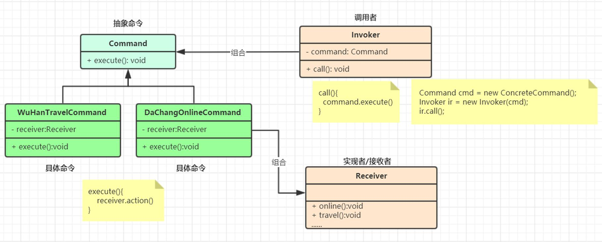

命令（Command）模式：将一个请求封装为一个对象，使发出请求的责任和执行请求的责任分割开。这样两者之间通过命令对象进行沟通，这样方便将命令对象进行储存、传递、调用、增加与管理。

命令模式就像是mvc模式

调用者就像是controller,组合了抽象命令service,然后controller中的方法执行了serviceimpl的方法,serviceimpl是具体命令,它里面又组合了实现者/接收者相当于dao层,然后serviceimpl调用了dao层的方法  (唯一有点标准的就是,controller层中需要具体的service方法,这个其实是无所谓的,只要能组合调用就行了,他更像是Struts)

就不写代码了,上面的话描述的很清楚了  调用者相当于controller,命令相当于service,实现者/接收者相当于dao