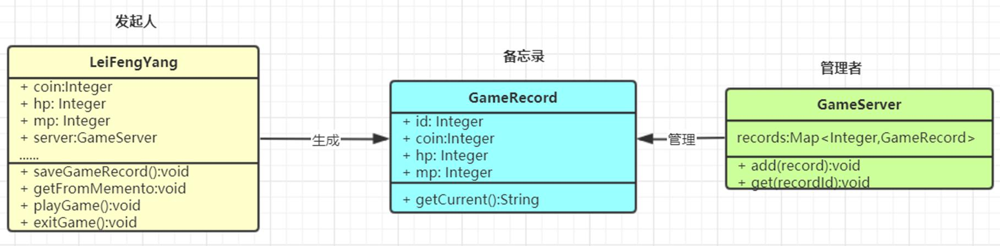

备忘录（Memento）模式：在不破坏封装性的前提下，捕获一个对象的内部状态，并在该对象之外保存这个状态，以便以后当需要时能将该对象恢复到原先保存的状态。该模式又叫快照模式。对象行为型模式


发起人（Originator）角色：记录当前时刻的内部状态信息，提供创建备忘录和恢复备忘录数据的功能，实现其他业务功能，它可以访问备忘录里的所有信息。
备忘录（Memento）角色：负责存储发起人的内部状态，在需要的时候提供这些内部状态给发起人。
管理者（Caretaker）角色：对备忘录进行管理，提供保存与获取备忘录的功能，但其不能对备忘录的内容进行访问与修改。


---

备忘录模式,核心在于快照,而不在于共享数据,当然也可以去共享数据,设计模式不是死的,但他的初衷在于快照,相当于事务
---
1. 发起人

```java
/**
 * @Description: 发起人角色   发起人角色和备忘录角色其实可以用一个抽象类或接口(这种只有属性有共同点的还是用抽象类比较好),这样也方便之后方法参数的传输与调用
 * @Author: zhang
 * @Date: 2022/8/12
 * @Version: v1.0
 */
@Data
@NoArgsConstructor
public class Gamer {
    // 以下属性是需要备忘的内容
    private String name;
    private String text;
    private LocalDateTime currentTime;
    // 以上是需要备忘的内容

    // 组合一个管理者,使用管理者将状态保存或者提取历史状态
    GameServer gameServer = new GameServer();

    // 提供一个保存备忘内容的方法
    public void saveContent(){
        gameServer.memoState(this);
    }

    // 提供一个从备忘中恢复的方法
    public Gamer extractContent(String name){
        Gamer gamer = gameServer.extractMemo(name);
        return gamer;
    }

    // 自己的一些方法,set 构造 业务方法啥的都可 (这里为了简单就使用构造了)
    public Gamer(String name, String text, LocalDateTime currentTime) {
        this.name = name;
        this.text = text;
        this.currentTime = currentTime;
    }

}
```

2. 记录角色(可以有,也可以无,看实际情况)

```java
/**
 * @Description: 备忘录角色 其实如果要是想要将发起者的所有信息都保存,直接不使用这个即可,这个可以着重保存发起者的那些信息,这里就保存那些属性了
 * @Author: zhang
 * @Date: 2022/8/12
 * @Version: v1.0
 */
@Data
public class Record {
    // 以下属性是需要备忘的内容
    private String name;
    private String text;
    private LocalDateTime currentTime;
    // 以上是需要备忘的内容


    // 提供一个获取当前记录的方法
    public Record getHistory(){
        return this;
    }
}
```

3. 管理者

```java

/**
 * @Description: 管理者
 * @Author: zhang
 * @Date: 2022/8/12
 * @Version: v1.0
 */
public class GameServer {
    // 维护一个map 里面存放着备忘信息
    Map<String, Record> recordMap = new HashMap<>();

    // 备忘方法,就是将需要备忘的内容保存进来
    public void memoState(Gamer gamer){
        // 使用BeanUtil将需要保存的内容进行保存
        Record record = new Record();
        BeanUtil.copyProperties(gamer, record);
        // 就先将name作为键了
        recordMap.put(record.getName(),record);
    }

    // 提取备忘方法
    public Gamer extractMemo(String name){
        Record record = recordMap.get(name);
        Gamer gamer = new Gamer();
        BeanUtil.copyProperties(record, gamer);
        return gamer;
    }

}
```

4. 使用

```java
public class MementoDemo {
    public static void main(String[] args) {
        Gamer gamer = new Gamer("gao","我爱学习", LocalDateTime.now());
        // 保存状态,事务开启
        gamer.saveContent();
        // 设置一个不想要,不应该发生的状态
        gamer.setText("我才不爱学习");
        // 这时因为有了上方的不想要的状态,就需要回滚
        gamer = gamer.extractContent("gao");
        System.out.println(gamer);
        // 如果将管理者设为单例,那么,就可以随时随地获取状态了,但是备忘录模式重在恢复,读取快照,就是在一系列未知操作时,备份一次,然后一系列操作将对象状态变为不理想状态,这时直接可以读取回滚,像是事务一样,所以说怎么用怎么实现根据场景来就行,重要的是他像事务一样
        //otherMethod();


    }

    public static void otherMethod(){
        // 从备忘录读取
        Gamer gamer = new Gamer();
        Gamer gamer1 = gamer.extractContent("gao");
        System.out.println(gamer1);
    }
}
```