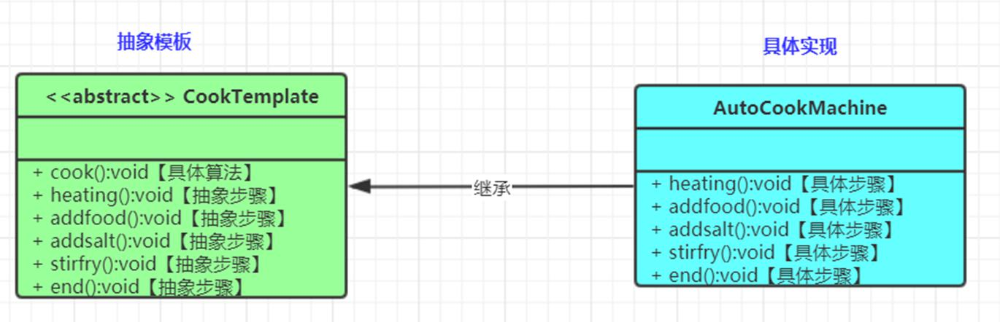

在模板模式（Template Pattern）中，一个抽象类公开定义了执行它的方法的方式模板。它的子类可以按需要重写方法实现，但调用将以抽象类中定义的方式进行



模板方法分为两个角色
抽象类和具体子类,但是这个具体子类可以无限扩展

1. 抽象类

```java

/**
 * @Description: 定义一个模板
 * @Author: zhang
 * @Date: 2022/8/11
 * @Version: v1.0
 */
public abstract class AbstractTemplate {

    // 定义算法定义模板 父类可以实现某些方法步骤,留关键方法让子类实现
    public void entertainment(){
        // 定义算法步骤
        // 打开电脑
        turnOnComputer();
        // 打开资源
        openResource();
        // 播放资源
        playResource();
        // 边看边吃
        eatWhileWatching();
    }
    // 吃什么由子类去定义
    protected abstract void eatWhileWatching();

    private void playResource() {
        System.out.println("资源播放中...");
    }
    // 播放什么由子类去定义
    protected abstract void openResource();

    private void turnOnComputer() {
        System.out.println("电脑打开中...");
    }
}

```

2. 具体实现

```java
public class ConcreteImpl extends AbstractTemplate{
    @Override
    protected void eatWhileWatching() {
        System.out.println("边吃水果边观看...");
    }

    @Override
    protected void openResource() {
        System.out.println("打开一部美剧...");
    }
}

public class ConcreteImpl2 extends AbstractTemplate{
    @Override
    protected void eatWhileWatching() {
        System.out.println("边吃炸鸡边看..");
    }

    @Override
    protected void openResource() {
        System.out.println("打开了动漫...");
    }
}

```

3. 使用

```java
public class Demo {
    public static void main(String[] args) {
        AbstractTemplate abstractTemplate = new ConcreteImpl();
        abstractTemplate.entertainment();
    }
}
```