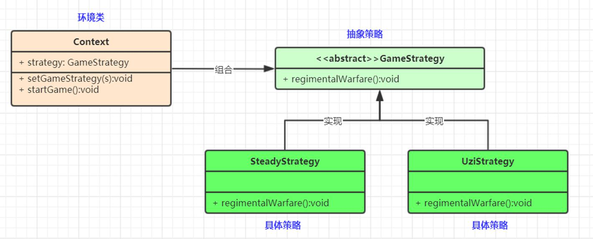

策略（Strategy）模式定义了一系列算法，并将每个算法封装起来，使它们可以相互替换，且算法的变化不会影响使用算法的客户。属于对象行为模式





策略模式的主要角色如下。
抽象策略（Strategy）类：公共接口，各种不同的算法以不同的方式实现这个接口，环境角色使用这个接口调用不同的算法，一般使用接口或抽象类实现。
具体策略（Concrete Strategy）类：实现了抽象策略定义的接口，提供具体的算法实现。
环境（Context）类：持有一个策略类的引用，最终给客户端调用。(环境类组合策略,并有一个设置策略的方法)


1. 抽象策略类

```java
// 策略接口
public interface StrategyInterface {
    // 比如说娱乐方式,或者实现方式算法
    void entertainment();
}
```

2. 具体实现的策略

```java

public class SleepStrategy implements StrategyInterface{
    @Override
    public void entertainment() {
        System.out.println("我要看电视了...");
    }
}

public class WatchVideoStrategy implements StrategyInterface{
    @Override
    public void entertainment() {
        System.out.println("我要睡觉了...");
    }
}

```

3. 环境类(这个是要给客户端调用的)

```java

public class Context {
    // 组合这个策略
    StrategyInterface strategyInterface;
    // 留一个方法去设置使用哪个策略
    public void setStrategyInterface(StrategyInterface strategyInterface) {
        this.strategyInterface = strategyInterface;
    }

    // 具体方法流程
    public void howToEntertainment(){
        System.out.println("我要开始娱乐了");
        strategyInterface.entertainment();
    }
}
```

4. 使用

```java
    public static void main(String[] args) {
        // 将环境类组合进来以使用
        Context context = new Context();
        // 使用睡觉策略
        context.setStrategyInterface(new SleepStrategy());
        context.howToEntertainment();
    }
	
```