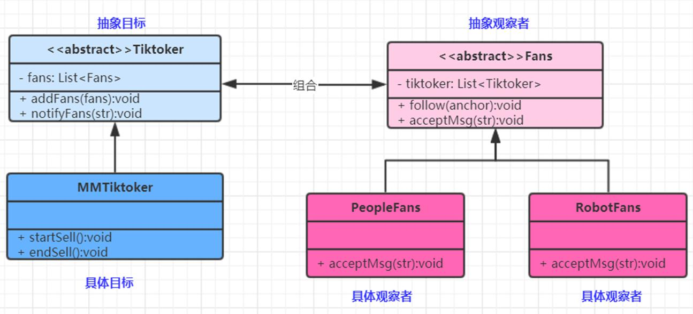

观察者模式(Observer Pattern)：定义对象间的一种一对多依赖关系，使得每当一个对象状态发生改变时，其相关依赖对象皆得到通知并被自动更新。观察者模式又叫做发布-订阅（Publish/Subscribe）模式、模型-视图（Model/View）模式、源-监听器（Source/Listener）模式或从属者（Dependents）模式。对象行为型模式




---

1. Subject目标

```java
/**
 * 抽象发布者(明星)
 */
public interface StarInterface {
    void addFans(FansInterface fans);
    // 通知粉丝
    void notifyFans(String msg);
}
```

2. ConcreteSubject具体目标

```java
public class Star implements StarInterface{
    List<FansInterface> fansList = new ArrayList<>();

    @Override
    public void addFans(FansInterface fans) {
        fansList.add(fans);
    }

    @Override
    public void notifyFans(String msg) {
        // 通知给每一个粉丝  核心
        fansList.forEach(fan ->{fan.acceptMsg(msg);});
    }
}
```

3. 观察者

```java

/**
 * 粉丝接口
 */
public interface FansInterface {
    // 关注的明星 (这要放置一个明星列表,在加对应的调用(通知)明星的方法,那就是双向观察了)
    List<StarInterface> starInterfaces = new ArrayList<>();

    // 接受到明星的消息
    void acceptMsg(String msg);
}
```


4. ConcreteObserver具体目标

```java

public class Fans1 implements FansInterface{
    
    @Override
    public void acceptMsg(String msg) {
        System.out.println("fans1收到了主播的消息:"+msg);
    }
}

public class Fans2 implements FansInterface{
    @Override
    public void acceptMsg(String msg) {
        System.out.println("fans2收到了主播的消息:"+msg);
    }
}

```

5. 使用

```java
public class ObserverDemo {
    public static void main(String[] args) {
        // 将fan12创建出来并且放到明星的通知列表中
        FansInterface fans1 = new Fans1();
        FansInterface fans2 = new Fans2();

        // 将以上俩位粉丝加到通知列表中
        StarInterface star = new Star();
        star.addFans(fans1);
        star.addFans(fans2);
        star.notifyFans("我来了");

        // 如果粉丝接口也有对应明星列表那么使用同样的方式,可以实现双向观察
    }
}
```

响应式编程的核心思想