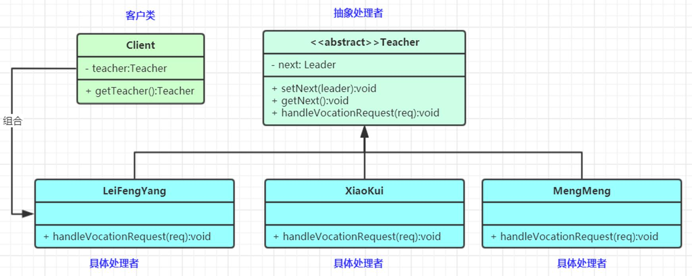

简单的责任链很好写,没必要实现了,就是自己处理完成之后交给下一个处理者,直至处理完成


责任链（Chain of Responsibility）模式：为了避免请求发送者与多个请求处理者耦合在一起，于是将所有请求的处理者通过前一对象记住其下一个对象的引用而连成一条链；当有请求发生时，可将请求沿着这条链传递，直到有对象处理它为止。属于对象行为型模式


抽象处理者（Handler）角色：  
定义一个处理请求的接口，包含抽象处理方法和一个后继连接。  
具体处理者（Concrete Handler）角色：  
实现抽象处理者的处理方法，判断能否处理本次请求，如果可以处理请求则处理，否则将该请求转给它的后继者。  
客户类（Client）角色：  
创建处理链，并向链头的具体处理者对象提交请求，它不关心处理细节和请求的传递过程。  




---


简单实现一个filter链条处理

1. 抽象处理者

```java
/**
 * 定义一个抽象处理者 模仿Filter接口
 */
public interface MyFilterInterface {
    // 定义一个处理方法
    void doFilter(Request request, Response response, FilterChain chain);
	// 这里之所以没有后继连接是因为,我们要写一个实现此接口的方法作为链条的维护者
}

@Data
public class Request {
    String msg; //请求内容
    public Request(String msg){
        this.msg = msg;
    }
}

@Data
public class Response {
    String content;
    public Response(String content){
        this.content = content;
    }
}
```

2. 链条维护者

```java

/**
 * @Description: 维护Filter链条
 * @Author: zhang
 * @Date: 2022/8/13
 * @Version: v1.0
 */
public class FilterChain implements MyFilterInterface {
    // 记录当前执行步骤,到哪个处理类(链节点)了
    private int cursor = 0;
    // 记录要执行的链条
    private List<MyFilterInterface> filters = new ArrayList<>();

    // 定义一个添加链节点的方法
    public void addFilter(MyFilterInterface filter) {
        filters.add(filter);
    }

    @Override
    public void doFilter(Request request, Response response, FilterChain chain) {
        // 第一次执行第一个filter 依次全部执行
        // 加一个判断,以防报错
        if (cursor < filters.size()) {
            // 这里有一个坑,千万不要像下方那样写,以为是递归调用的,如果像下方那样写,会一直执行不到cursor++导致堆栈溢出
//            filters.get(cursor).doFilter(request,  response,  chain);
//            cursor++;
            // 上方写法是错误的,会导致堆栈溢出stackoverflow
            MyFilterInterface myFilterInterface = filters.get(cursor);
            cursor++;
            myFilterInterface.doFilter(request, response, chain);
        } else {
            System.out.println("已经走完链条,即将返回数据");
            response.setContent(request.getMsg());
            System.out.println("response.getContent() = " + response.getContent());
        }
    }
}

```

3. 具体处理者

```java

public class EncryptionFilter implements MyFilterInterface{
    @Override
    public void doFilter(Request request, Response response, FilterChain chain) {
        // 对request中内容加密
        AES aes = SecureUtil.aes("feiyao16gezijie1".getBytes(StandardCharsets.UTF_8));
        request.setMsg(aes.encryptBase64(request.msg));
        // 放行
        System.out.println("EncryptionFilter finish ... greenLight");
        chain.doFilter(request,response,chain);
        System.out.println("recursively completing the next program : EncryptionFilter");

    }
}


public class LowerFilter implements MyFilterInterface{
    @Override
    public void doFilter(Request request, Response response, FilterChain chain) {
        // 将request中内容全部转为小写
        request.setMsg(request.getMsg().toLowerCase());
        // 放行
        System.out.println("LowerFilter finish ... greenLight");
        chain.doFilter(request,response,chain);
        System.out.println("recursively completing the next program : LowerFilter");
    }
}
```

4. 客户端角色

```java

    public static void main(String[] args) {
        FilterChain chain = new FilterChain();
        // 设置链条节点
        chain.addFilter(new LowerFilter());
        chain.addFilter(new EncryptionFilter());
		// 就在这里设置链条并使用了
        chain.doFilter(new Request("WO_YAO_ZHUAN_QIAN"),new Response("这里会被覆盖,主要不在这里体现,所以无所谓了"), chain);

    }
```


