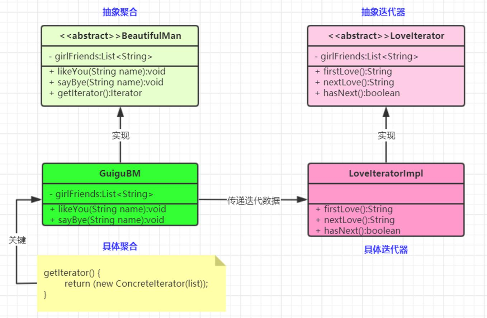

迭代器（Iterator）模式：提供一个对象(迭代器)来顺序访问聚合对象(迭代数据)中的一系列数据，而不暴露聚合对象的内部表示。对象行为型模式


抽象聚合（Aggregate）角色：  
	定义存储、添加、删除聚合对象以及创建迭代器对象的接口。
具体聚合（ConcreteAggregate）角色：  
	实现抽象聚合类，返回一个具体迭代器的实例。
抽象迭代器（Iterator）角色：  
	定义访问和遍历聚合元素的接口，通常包含 hasNext()、first()、next() 等方法。
具体迭代器（Concretelterator）角色：  
	实现抽象迭代器接口中所定义的方法，完成对聚合对象的遍历，记录遍历的当前位置。




几乎不需要写迭代器,原生代码中已经很全了,除非我们有自己的侧重重写迭代的逻辑

---


1. 抽象聚合类(相当于List接口)

```java

/**
 * @Description: 抽象聚合类,相当于list接口
 * @Author: zhang
 * @Date: 2022/8/13
 * @Version: v1.0
 */
public abstract class AbstractAggregate<E> {
    // 定义添加
    abstract void add(E e);
    // 定义删除
    abstract void remove(Object o);
    // 定义获取迭代器
    abstract Iterator getIte();
}
```

2. 具体聚合类

```java
// 相当于ArrayList
public class ConcreteAggregate<String> extends AbstractAggregate<String>{
    // 维护一个列表 这初始容量定义为100,主要看迭代器,就不实现那么多功能了
    private List<String> list = new ArrayList<>();


    @Override
    void add(String string) {
        list.add(string);
    }

    @Override
    void remove(Object o) {
        list.remove(o);
    }

    @Override
    Iterator getIte() {
        return new ConcreteItr();
    }
    // ArrayList中也是使用了内部类,所以也跟着这样写吧
    public class ConcreteItr implements Iterator{
        // 维护一个指针
        private int cursor = 0;
        @Override
        public Object next() {
            String string = list.get(cursor);
            cursor++;
            return string;
        }

        @Override
        public boolean hasNext() {
            return cursor<list.size();
        }
        // 还有很多方法,比如获取头获取尾之类的就不写了
    }
}

``

3. 抽象迭代器

```java
/** 定义一个迭代器接口
 *
 */
public interface Iterator {

    // 获取下一个元素
    public Object next();

    // 是否有下一个元素
    boolean hasNext();

}

```

4. 具体迭代器

具体迭代器写在了具体聚合类中,为内部类,ArrayList也是这样写的,其实具体迭代器的针对性强,所以写在具体聚合类中好像更加方便合适


5. 使用

```java

public class IteratorDemo {
    public static void main(String[] args) {
        // 使用聚合类的迭代器
        AbstractAggregate concreteAggregate = new ConcreteAggregate();
        concreteAggregate.add("gao");
        concreteAggregate.add("lu");
        concreteAggregate.add("q");
        Iterator ite = concreteAggregate.getIte();

        while(ite.hasNext()){
            Object next = ite.next();
            System.out.println(next);
        }
    }
}
```