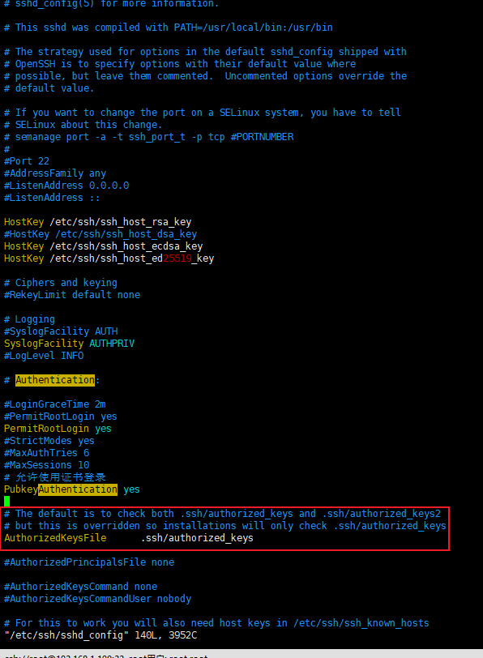
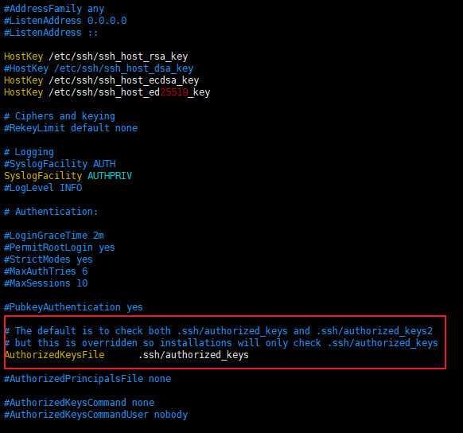

两个服务器之间scp可以从远端复制到本地,也可以从本地复制到远端,就是scp后两个位置的问题

`scp localfile user@ip:dir/tarfile`和`scp user@ip:dir/remotefile localdir/localname`

---

实现免密登录

首先免密是使用本地的私钥访问远端服务的公钥,看看能不能匹配的上,如果匹配上了就可以进行复制或者ssh各种操作了

1. 生成配套的私钥公钥

`ssh-keygen -t rsa`使用rsa的方式生成公钥私钥对,默认目录在`(/root/.ssh/id_rsa)`用户目录下

2. 将公钥放入远程服务器下

`user/.ssh`目录下放入公钥,然后查看服务器配置文件`vim /etc/ssh/sshd_config`

默认配置即可

红框中圈出来的就是需要将公钥放入这个文件中,可使用`cat 公钥 >> authorized_keys`

其实还可以使用一种更加便捷的方式`ssh-copy-id 本地公钥 远端用户@远端ip`即可自动配置

此时即可测试是否可以进行ssh,发现可以连通

---

简化步骤

1. 本地服务使用`ssh-keygen -t rsa` 
2. 将本地生成的公钥注册到远端服务的authorized_keys授权秘钥中 `ssh-copy-id -i id_rsa.pub 远端用户@远端ip`
3. 本地可免密使用ssh
4. 远端想要免密本地同理

注意一般免密不了,很大概率是文件权限不对